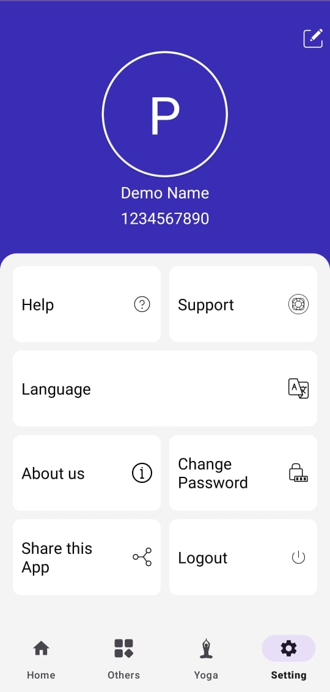
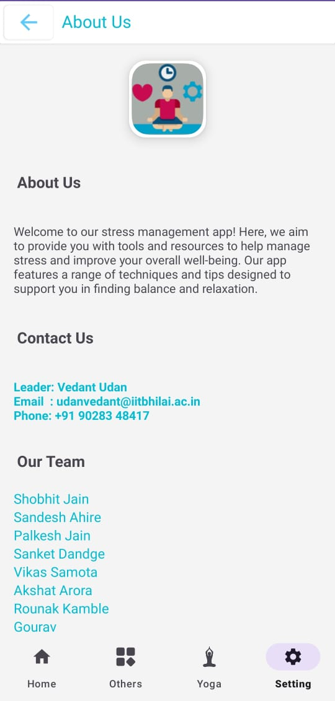
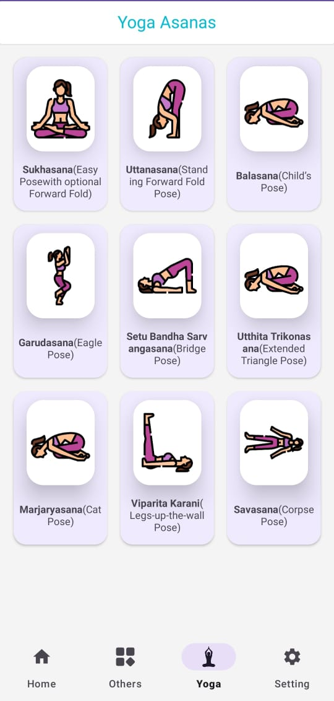

## Bottom Navigation Bar 
- Fragment 1: Home 
- Fragment 2: Other Activities
- Fragment 3: Yoga/Excercise
- Fragment 4: Setting 

### Home Fragment 
- consist of Images and text for the user. 
- focused around the healthy activities like consuming dairy products, eating bananas, leafy vegetables and other healthy activities

### Yoga/Excercise Fragment 
- when opening it. it will give a list of all the stored Excercise. 
- taping the name of the Excercise will  open that Excercise.

### Other Activities Fragment
- Stress Meter
- user
- Fidgeting
- Concentration Music

#### Fidgeting Activity 
- Tap/Tap 
- Random Tap 

 
#### Concentration music Activity
- will give a list of pre-installed relaxing music

#### Stress Meter Activity 
- will take a quiz of the user and give a number on the scale of 10 (sgpa)
- next quiz will update the sgpa into csgpa

### User Setting Fragment 
- record a local history of the user (reward point monitor)

#### Schedules/activities
- Drink Water periodically
- wake up alarm 
- sleep reminder 
- Caffeine limiter 

#### Tips:
Random tips popuping in the app. reminding the user of the ....

### App Progress

  
  
  

