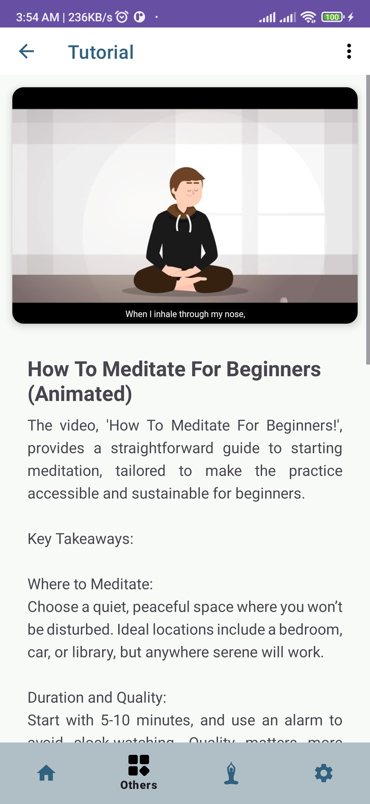

# Stress Management App

A mobile app designed to help users manage stress through a variety of interactive tools and activities. This app offers features like yoga practices, breathing exercises, daily challenges, and other stress-relief activities.

## Features

The Stress Management app is built around four main sections, each providing unique tools and resources to reduce stress and enhance well-being.

### Home Fragment

The **Home Fragment** serves as the central hub of the app. From here, users can access:
- **Getting Started**: Guidance on how to use the app and adopt a progressive approach to stress management.
- **Breathing Exercise**: Offers structured breathing exercises to calm the mind and body.
- **Consult AI Doctor**: A chat-based feature to consult with an AI-based doctor for stress-related queries.
- **Gratitude Journal**: Allows users to reflect on their day by writing in a journal. Users can view and edit past entries as well.

Additional sections within the Home Fragment include:
- **Daily Challenge**: Provides a new activity each day, helping users engage in stress-relieving practices regularly.
- **Good Habits**: Lists healthy habits that can improve mental and physical well-being over time.

### Yoga Fragment

The **Yoga Fragment** introduces users to a selection of yoga poses designed to relieve stress. Key features include:
- **Yoga Poses**: A range of poses with detailed descriptions and images to guide users in practicing each pose.
- **Yoga Details**: Detailed information on each selected yoga pose, including the benefits and proper technique for stress relief.

### Others Fragment

The **Others Fragment** offers a range of creative and soothing activities, such as:
- **Music Player**: A curated playlist of calming tracks to help users relax and focus.
- **Stress Meter**: An interactive tool that lets users check their current stress levels by answering a set of questions.
- **Fidget Spinner**: A virtual fidget spinner to help users manage anxiety through sensory engagement.
- **Learn Meditation**: A section with tutorials and videos on meditation techniques. Users can watch guided meditation videos to relax and focus.

### Settings Fragment

The **Settings Fragment** provides customization options for a personalized app experience. Key sections include:
- **Profile**: Manage personal details and preferences.
- **Language Setting**: Select the app's language for a more comfortable experience.
- **About Us**: Information about the development team and the purpose behind the app.
- **Support**: Get assistance with app features or report issues.
- **Help (FAQ)**: Frequently Asked Questions to guide users through common queries.

---

## Permissions

This app requires the following permissions:
- **Internet**: For downloading yoga and meditation resources.
- **Vibration**: Enables tactile feedback during activities.
- **Read External Storage**: Allows users to upload media for journaling or profile customization.

---

## Navigation Flow

This app uses a structured navigation flow, making it easy to switch between fragments. Each fragment is interconnected for a seamless user experience, providing both variety and accessibility.

## Screenshots

### Home Fragment

    
    
    

  
  
  

### Yoga Fragment

  
  

### Others Fragment

  
  
  

  
  
  

### Settings Fragment

  
  
  

</d>